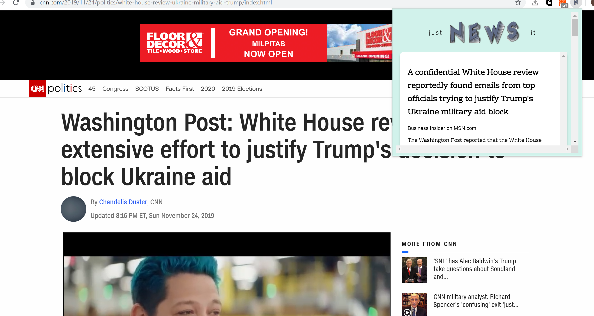

# JustNewsIt!
This is a Chrome Extension that lets you instantly cross reference the content you're currently reading to news articles that discuss similar topics and ideas to improve the reliability of information we interact with.

Backend server is included in scrape.py and the main extension is within the ext folder.

